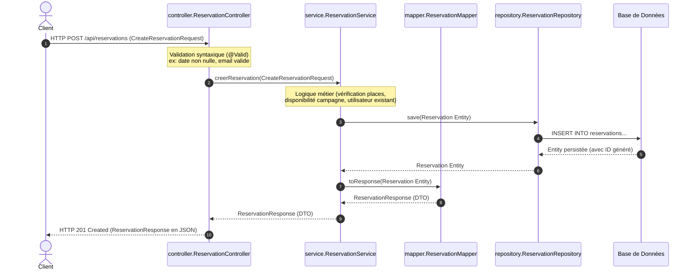

# Architecture Backend - Plateforme Prévention FOSMEF

Ce document décrit l'architecture logicielle adoptée pour le backend de l'application de prévention FOSMEF. L'objectif est de structurer le code de manière propre, modulaire et extensible, en séparant clairement les responsabilités (Clean Architecture / N-Tier Architecture).

---

## Structure des Dossiers

Le code source réside dans le package principal `com.fosmef.prevention` sous `src/main/java/` :

```text
src/main/java/com/fosmef/prevention/
│
├── PreventionApplication.java # Point d'entrée principal (Main Application class)
│
├── config/              # Configurations globales (CORS, Swagger/OpenAPI, Beans spécifiques)
│
├── controller/          # Points d'entrée de l'API REST (@RestController, Validation des entrées)
│
├── service/             # Logique métier (Interfaces de service)
│   ├── impl/            # Implémentations concrètes des services (Gestion des transactions)
│   └── CampagneService.java
│
├── repository/          # Couche d'accès aux données (Interfaces Spring Data JPA)
│
├── entity/              # Modèles de base de données / Entités JPA (User, Campagne, Reservation, Enums)
│
├── dto/                 # Data Transfer Objects (Objets de transfert de données)
│   ├── request/         # DTOs pour les données reçues (POST/PUT - ex: CreateCampagneRequest)
│   └── response/        # DTOs pour les données retournées (GET/POST - ex: CampagneResponse)
│
├── mapper/              # Mappings / Conversion entre Entités JPA et DTOs (ex: MapStruct)
│
├── exception/           # Gestion globale des exceptions (@ControllerAdvice, structures d'erreurs standardisées)
│
└── security/            # Sécurité (Configuration JWT, filtres d'authentification, UserDetailsService)
```

---

## Description des Différentes Couches

### 1. `entity/` (Entités JPA)
Cette couche contient les objets métiers qui représentent les tables de notre base de données relationnelle (PostgreSQL).
* **Technologie** : Annotations de Jakarta Persistence (ex: `@Entity`, `@Table`, `@Id`, `@ManyToOne`, `@JoinColumn`, `@Version`).
* **Règle** : Les entités doivent se concentrer uniquement sur la représentation des données et les mappings de relations. Elles ne doivent pas contenir de logique métier complexe ou de validation d'API.

### 2. `repository/` (Repositories)
Fournit l'abstraction pour l'accès aux données.
* **Technologie** : Spring Data JPA (`JpaRepository<Entity, ID>`).
* **Règle** : Contient uniquement des déclarations de requêtes personnalisées (méthodes avec conventions de nommage Spring Data ou annotations `@Query`). Aucun traitement logique ne doit être fait ici.

### 3. `service/` & `service/impl/` (Logique Métier)
C'est le cœur de l'application. Cette couche contient toutes les règles métiers (ex: vérification des places disponibles, validation des dates, hashage des mots de passe).
* **Règle** : On utilise une **interface** dans `service/` et son **implémentation** dans `service/impl/`. Cela permet de découpler les couches et facilite le mock/test unitaire. Les transactions (`@Transactional`) sont gérées à ce niveau.

### 4. `dto/` (Data Transfer Objects)
Les DTOs permettent d'exposer uniquement les données nécessaires au frontend, protégeant ainsi la structure interne de la base de données.
* **`dto/request/`** : Représente les données requises pour créer ou modifier une ressource. Contient les annotations de validation (ex: `@NotBlank`, `@Email`, `@Min`).
* **`dto/response/`** : Représente les données renvoyées par l'API.

### 5. `mapper/` (Mappers)
Assure la conversion bidirectionnelle entre les Entités et les DTOs.
* **Technologie** : Recommandé d'utiliser **MapStruct** pour générer les mappers automatiquement à la compilation pour de meilleures performances.
* **Règle** : Évite d'écrire du code de conversion manuel répétitif (`set/get`) dans les services ou contrôleurs.

### 6. `controller/` (Contrôleurs REST)
Gère les requêtes HTTP entrantes (GET, POST, PUT, DELETE), valide les DTOs de requête via `@Valid` et appelle la couche service appropriée.
* **Technologie** : `@RestController`, `@RequestMapping`, `@Valid`.
* **Règle** : Les contrôleurs doivent rester fins ("skinny controllers"). Aucune logique métier ou requête directe à la base de données ne doit y figurer.

### 7. `config/` (Configurations)
Regroupe les classes de configuration de Spring (ex: configuration CORS, OpenAPI/Swagger, Beans personnalisés).

### 8. `exception/` (Gestion des Erreurs)
Gère de façon centralisée toutes les exceptions lancées par les contrôleurs ou les services pour retourner des réponses HTTP claires et uniformes en JSON (ex: `404 Not Found`, `400 Bad Request`).
* **Technologie** : `@RestControllerAdvice` et `@ExceptionHandler`.

### 9. `security/` (Sécurité)
Contient l'implémentation de la sécurité de l'application.
* **Technologie** : Spring Security, JWT (JSON Web Tokens).
* **Règle** : Filtre les requêtes entrantes pour valider les tokens d'authentification et configure les droits d'accès par rôle (ex: `ADHERENT` vs `GESTIONNAIRE`).

---

## Flux de Données Typique (Cycle d'une Requête)

Voici comment une requête de création de réservation (`POST /api/reservations`) traverse l'architecture :



---

## Avantages de cette Architecture

1. **Facilité de Test** : Chaque couche peut être testée isolément (tests unitaires avec mock).
2. **Découplage** : Si la base de données ou le schéma change (couche `entity`), l'API exposée (couche `dto`) peut rester identique grâce aux mappers.
3. **Lisibilité** : Chaque classe a une unique responsabilité claire (S.O.L.I.D).
4. **Maintenance simplifiée** : Il est facile de localiser un bug ou d'ajouter une fonctionnalité sans casser le reste du système.
